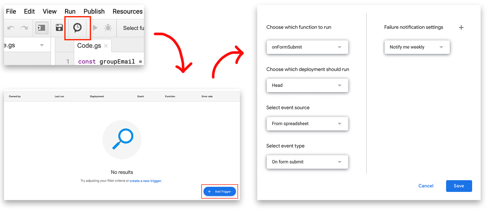

# Google Form to Mailing List

Add emails from a Google Sheet to a Google Groups mailing list

##### Note: Make sure that the script is being run from an account that has access to the Google Group

## How Do I Use This?

### all-reponses.js
You do not need this to be linked to a Google Form. This will take all emails in a column and add them to the mailing list

### new-responses.js
This requires the sheet to be linked to a Google Form. It will automatically add new responses to the mailing list

### Instructions
1. Within your sheet, go to *Tools > Script Editor*
2. Copy and Paste your chosen script into the Google Apps Script editor
3. Enable AdminDirectory in the script editor: *Resources > Advanced Google Services > Admin Directory API*
4. Change the const variables to your info

**If you're using `all-reponses.js`:** Select the `addMembersFromSheet` function, and click run

**If you're using `new-responses.js`:** Add a new trigger to the script
  
  
